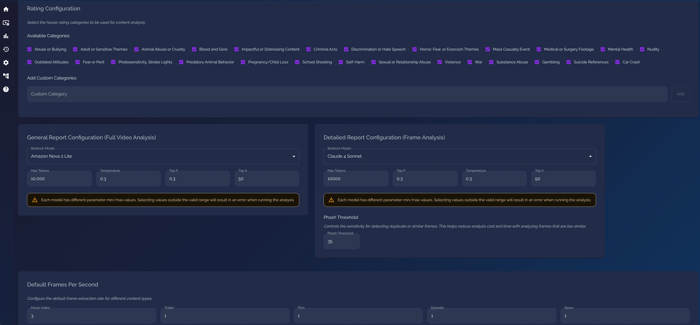
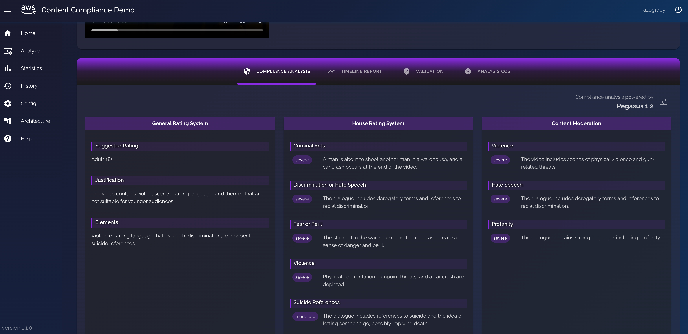
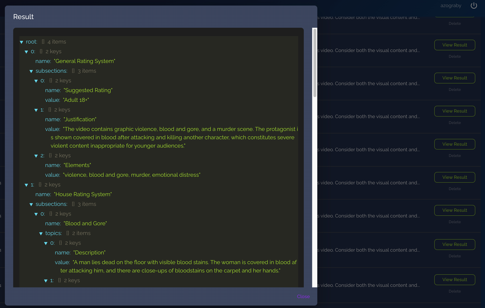
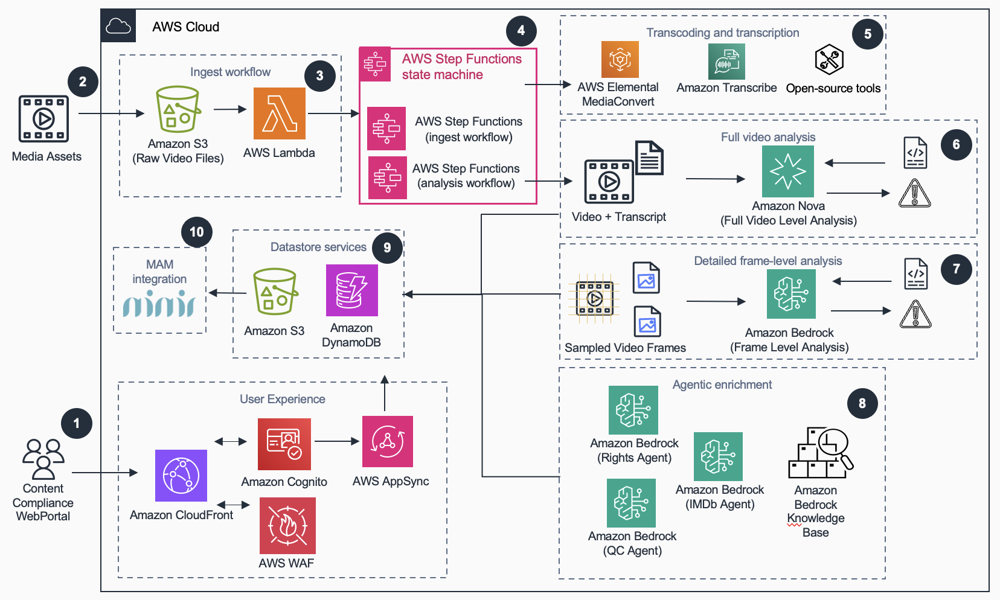
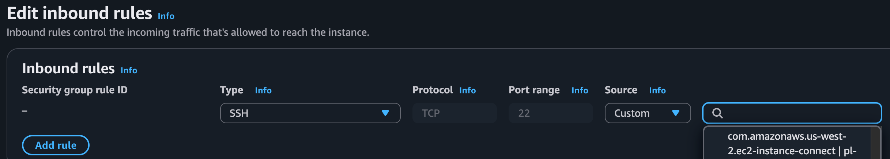
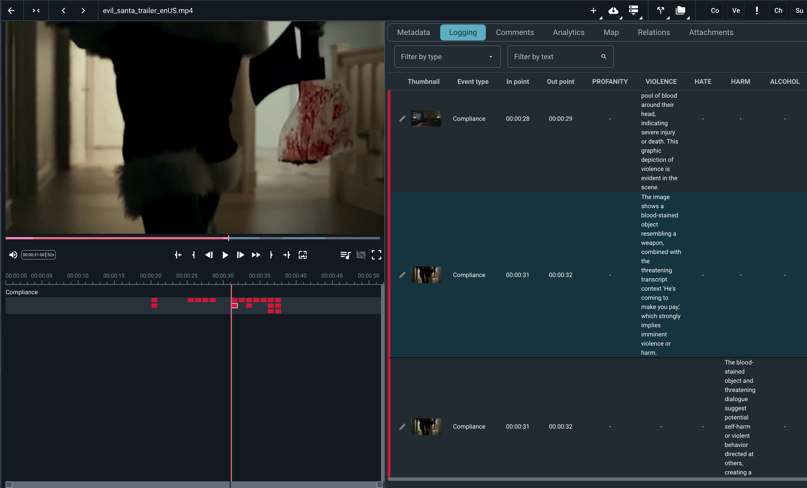

# Guidance for Automated Content Compliance with AI-powered Video Analysis and Agents

Automate content compliance with AI-powered video analysis that transforms hours of manual review into minutes, helping broadcasters and streaming platforms deliver compliant media content faster and more cost-effectively. Leverage Amazon Bedrock to analyze content across multiple rating systems, while maintaining accuracy, and reducing cost.

## Table of Contents

1. [Overview](#overview)
    - [Architecture](#architecture)
    - [Cost](#cost)
2. [Prerequisites](#prerequisites)
3. [Deployment Steps](#deployment-steps)
4. [Deployment Validation](#deployment-validation)
5. [Next Steps](#next-steps)
6. [Cleanup](#cleanup)
7. [FAQ, known issues, additional considerations, and limitations](#faq-known-issues-additional-considerations-and-limitations)
8. [Notices](#notices)
9. [Authors](#authors)

## Overview

#### Overview of Problem

- Reviewing video/image content for compliance issues is challenging and costly
- Media companies are struggling with exploding content volumes, strict compliance requirements, and rising operational costs
- Compliance review times are increasing due to complex, multi-regional requirements
- Human review is error-prone and exhausting

#### Overview of Solution

- Automate the content moderation process with advanced video analysis using both video and image understanding models
- Ensure consistent reviews across your content library, reducing the number of false negatives
- Achieve a content rating, similar to popular media rating taxonomies
- Process long-form video of multi-hour long feature films
- Get detailed analysis results at the video, and frame-level including timestamp-level details of compliance flags
- Catches nuanced content elements that a human reviewer may miss, leaving compliance officers to focus on tasks that require human judgement

#### Why this Solution?

- Simply upload media to the system, and it automatically analyzes every frame against multiple rating systems and compliance standards
- Customize what flags you are looking for in the UI
- Choose your frame analysis rate in the UI (e.g. music videos, sports are dynamic and fast-changing, requiring a faster frame rate)
- Generate comprehensive compliance reports with frame-accurate timestamps
- Cost-optimization techniques such as perceptual hashing to reduce frame analysis cost of similar frames

#### Architecture

##### How it Works

1. **Configure** your analysis settings on the Config page. Choose which Bedrock models to use for video and frame analysis, adjust inference parameters (temperature, topP, maxTokens), set the pHash threshold for frame deduplication, and select house rating categories. These settings are used by the rest of the solution.
  

2. **Upload** an MP4 video on the Analyze page and select a content type (Film, Episodic, Trailer, Music Video, News). The content type determines the default frames-per-second rate used for frame extraction, as configured on the Config page.


3. An S3 upload event triggers an **AWS Step Functions workflow** that orchestrates the full pipeline:
   - **MediaConvert** generates HLS playback assets and thumbnail frames.
   - **Amazon Transcribe** generates a transcript (or you can provide one).
   - The video is split into segments and each segment is analyzed by a Bedrock model against your configured compliance categories.
   - **Frame-level analysis** runs concurrently using a Distributed Map, with pHash-based deduplication to skip similar frames.
   - **Bedrock Agents** run optional validations: rights clearance, QC language checks, and IMDb cross-referencing.
   - A **general and detailed compliance report** is generated.

4. **View results** on the Analysis Results page with video playback, segment-level findings, frame annotations, transcript, agent reports, and cost breakdown.  
  
  
  

All processing happens in the background. You can navigate away and find completed results in the History page.




##### Architecture Diagram


#### Pages

| Page | Description |
|---|---|
| **Analyze** | Upload MP4 videos and kick off the compliance workflow. Select content type and monitor upload progress. |
| **Analysis Results** | View compliance reports, video playback with HLS, frame-level findings, transcript, agent results, and analysis cost. |
| **History** | Browse all previously analyzed videos and their results. |
| **Config** | Configure which Bedrock models to use for video and frame analysis, adjust inference parameters (temperature, topP, maxTokens), set the pHash threshold for frame deduplication, and manage house rating categories. |
| **Statistics** | View cost and usage statistics across all your analyses for the current month. |
| **Architecture** | Overview of the AWS services and architecture powering the solution. |
| **Help** | FAQ, tips, troubleshooting, and known limitations. |


### Cost

_You are responsible for the cost of the AWS services used while running this Guidance. As of June 2026, the cost for running this Guidance in the US West (Oregon) Region is approximately **$330 per month** for processing **50 hours of video** (for example, 50 one-hour titles at 1 frame per second), using Amazon Nova Pro for video (segment) analysis and Amazon Nova 2 Lite for frame analysis. This figure is highly sensitive to the configuration choices described below._

> ⚠️ Content compliance cost is highly dynamic. The number above is a rough planning estimate, not a quote. Your actual cost depends heavily on the foundation models you select, the frame-analysis frame rate, the pHash deduplication threshold, the type of content (fast-moving footage dedupes less than static footage), how long your videos are, and which optional steps (frame analysis, agents) you enable. Use the in-app **Analysis Cost** tab and **Statistics** page to measure cost against your own content, and [AWS Cost Explorer](https://aws.amazon.com/aws-cost-management/aws-cost-explorer/) for the authoritative bill.

#### What drives cost

The main cost drivers are Amazon Bedrock model usage, Amazon Transcribe, and AWS Elemental MediaConvert. Frame-level analysis is the largest Bedrock line item: it runs the configured model against extracted frames (1 fps by default), so its cost scales with video length, frame rate, how aggressively pHash filters out similar adjacent frames, and the per-token price of the model you choose. The estimate below uses **Amazon Nova 2 Lite** for frame analysis, which is far cheaper than a premium model, frame analysis alone can be up to ~80% of the total. The remaining cost comes from the video (segment-level) analysis, the optional validation agents, Amazon Transcribe, AWS Elemental MediaConvert, and the supporting serverless services that run the pipeline and host the app.

#### What changes your cost (and by how much)

Cost can swing by an order of magnitude depending on a few choices. The most important ones, roughly in order of impact:

- **Frame-analysis model — the single biggest lever.** Per-frame price runs from very low to roughly 6–7x that for higher cost models. Changing only this can move the monthly bill from a few hundred to a few thousand dollars.
- **Frame rate (fps).** Frame-analysis cost scales directly with fps. The default is 1 fps, but the Music Video content type defaults to 3 fps — about 3x the frames and ~3x the frame-analysis cost.
- **pHash deduplication threshold.** A higher threshold filters out more near-duplicate frames, cutting the number of billable Bedrock calls. Raising it trims cost; lowering it analyzes more frames and costs more.
- **Content type and motion.** Fast-moving, dynamic footage (sports, music videos, action) dedupes poorly, so more unique frames are analyzed. Static or slow content (news, interviews) dedupes heavily and costs much less for the same duration.
- **Video length.** The Bedrock, Transcribe, and MediaConvert line items all scale roughly linearly with minutes of video.
- **Optional steps.** Frame analysis and the validation agents can each be turned off. Skipping frame analysis removes the largest Bedrock line item entirely.
- **Video (segment) model and inference params.** The segment-analysis model and settings such as `maxTokens` change token volume and therefore cost.
- **Region and pricing model.** These estimates assume On-Demand pricing in us-west-2. A different Region, Provisioned Throughput, or Batch inference (see below) will change the numbers.

Because of this, treat the figures here as a starting point and measure against your own content using the in-app **Analysis Cost** tab.

#### Illustrative breakdown per hour of video

The table below estimates the cost to process **one hour of video** with a cost-optimized configuration: video (segment) analysis on Amazon Nova Pro, frame analysis on Amazon Nova 2 Lite at 1 fps, and agents enabled. It assumes the pHash threshold is raised slightly above the default so that roughly two-thirds of the extracted frames are filtered out as near-duplicates (about 1,200 frames analyzed per hour). All figures are On-Demand estimates for US West (Oregon) and are rounded.

| Component | Service | Est. cost / hour of video | Notes |
| --- | --- | --- | --- |
| Frame analysis | Amazon Bedrock (Amazon Nova 2 Lite, 1 fps) | ~$2–3 | ~1,200 frames/hour after pHash filtering. Scales with frame rate, pHash threshold, content motion, and model choice |
| Video (segment) analysis | Amazon Bedrock (Amazon Nova Pro) | ~$0.92 | Per hour of video; matches the in-app FAQ benchmark |
| Validation agents (rights, QC, IMDb, profanity) | Amazon Bedrock (Nova Lite / Nova Pro) | ~$0.20 | Optional; run once per analysis, not per frame |
| Transcription | Amazon Transcribe | ~$1.44 | Standard batch at $0.024/min ([pricing](https://aws.amazon.com/transcribe/pricing/)) |
| Media processing | AWS Elemental MediaConvert | ~$1.00–1.40 | One 360p HLS rendition (~$0.45/hr) + frame-capture JPEGs billed per output minute at the source resolution (~$0.45/hr SD to ~$0.90/hr HD). Basic tier AVC ([pricing](https://aws.amazon.com/mediaconvert/pricing/)) |
| Orchestration, compute, storage, API, auth, hosting | AWS Step Functions, AWS Lambda, Amazon S3, Amazon DynamoDB, AWS AppSync, Amazon API Gateway, Amazon Cognito, Amazon CloudFront | ~$0.40 | Mostly S3 storage of the source video, chunk copies, HLS, frames, and reports (~$0.15/hr). Step Functions transitions are cheap and the frame Lambda is only 128 MB; DynamoDB, AppSync, API Gateway, Cognito, and CloudFront are negligible at this scale |
| **Total** | | **~$5–7 / hour of video** | |

At a representative **~$6.50 per hour of video**, processing 50 hours per month comes to roughly **$330/month** (the sample table below totals ≈$330). You can push this lower by reducing the frame rate, raising the pHash threshold further, or skipping frame analysis entirely (video-level only), which drops the total to about **~$4 per hour** (~$200/month for the same 50 hours). See the cost-reduction tips in the app's Help page.

#### Can Amazon Bedrock Batch inference lower this?

[Amazon Bedrock Batch inference](https://aws.amazon.com/bedrock/pricing/) runs at 50% of On-Demand pricing, which makes it appealing for the high-volume frame-analysis step. It is **not used by this solution today** — the pipeline calls Bedrock synchronously (`InvokeModel`) inside a Step Functions Distributed Map so results stream back in near real time. Adopting Batch would mean re-architecting frame analysis to write all frames to a JSONL file in Amazon S3, submit an asynchronous job, poll for completion, and parse the S3 output. 

#### Get exact costs for your own content

Because cost is so content-dependent, the most accurate way to estimate it is to run your own media through the app and read the numbers it reports in the UI:

- **Analysis Cost tab — exact cost per video.** After an analysis completes, open the **Analysis Cost** tab on the Analysis Results page to see the precise pricing. 

- **Statistics tab — aggregate cost across your library.** The **Statistics** page rolls up cost and usage across all of your analyses for the current month (total spend, videos processed, total video duration, and a breakdown by model and by provider), which is useful for tracking and forecasting spend over time.

#### Important notes on the in-app cost figures

The cost numbers shown on the **Statistics** page and the **Analysis Cost** tab are estimates that include **only Amazon Bedrock and Amazon Transcribe** usage. They do not include AWS Elemental MediaConvert, Amazon S3, Amazon DynamoDB, AWS Lambda, or AWS Step Functions. In-app pricing is based on On-Demand rates in the us-west-2 Region and is not a production-grade metering system.

_We recommend creating a [Budget](https://docs.aws.amazon.com/cost-management/latest/userguide/budgets-managing-costs.html) through [AWS Cost Explorer](https://aws.amazon.com/aws-cost-management/aws-cost-explorer/) to help manage costs. Prices are subject to change. For full details, refer to the pricing webpage for each AWS service used in this Guidance._

### Sample Cost Table

**Note:** The figures below are estimates derived from the per-hour breakdown above. Use them for rough planning only.

The following table provides a sample monthly cost breakdown for running this Guidance in the US West (Oregon) Region, processing 50 hours of video per month with the cost-optimized configuration described above.

| AWS service | Dimensions | Cost [USD/month] |
| --- | --- | --- |
| Amazon Bedrock — frame analysis | Amazon Nova 2 Lite; ~60,000 frames/month (~1,200/hr after pHash filtering) at 1 fps | $120 |
| Amazon Bedrock — video (segment) analysis | Amazon Nova Pro; 50 hours of video (~$0.92/hr) | $46 |
| Amazon Bedrock — validation agents | Nova Lite / Nova Pro; rights, QC, IMDb, profanity, JSON repair | $10 |
| Amazon Transcribe | Standard batch; 3,000 minutes (50 hours) at $0.024/min | $72 |
| AWS Elemental MediaConvert | Basic tier AVC; one 360p HLS rendition + frame-capture JPEGs at source resolution; 50 hours | $60 |
| AWS Step Functions | Standard workflow; ~50 executions; transcript/MediaConvert polling loops + frame Distributed Map (~1,200 child iterations/hr) | $4 |
| AWS Lambda | Pipeline functions + ~60,000 frame invocations at 128 MB | $5 |
| Amazon S3 | Source video, HLS, frames, transcripts, reports (~250 GB) | $8 |
| Amazon DynamoDB | On-demand; jobs, results, statistics, and log tables | $1 |
| AWS AppSync | GraphQL queries from the web app | $2 |
| Amazon API Gateway | REST endpoints (Mimir / custom actions) | $1 |
| Amazon Cognito | < 50 monthly active users | $0.00 |
| Amazon CloudFront | Static frontend delivery, low traffic | $1 |
| **Total** | **50 hours of video per month** | **≈ $330** |

## Prerequisites
> ⚠️ **IMPORTANT: Ensure the prerequisites are complete before moving onto the deployment steps.**

### Operating System
You will need an environment to run the deployment steps from. This will be your temporary working space. 

- Local development/deployment has been tested on Mac and Windows
- To develop/deploy from an AWS environment, you may use an Amazon Linux 2023 kernel-6.1+ AMI to run the deployment steps. 
  - Create an EC2 instance with the AMI above
  - Ensure the EC2 instance type is at least a t3.medium
  - Ensure the EC2 instance has an IAM role with sufficient permissions to deploy the CDK stacks
  - Add a security group inbound rule allowing SSH from the EC2 Instance Connect prefix list
  
  - Then, connect to the instance following [these steps](https://docs.aws.amazon.com/AWSEC2/latest/UserGuide/ec2-instance-connect-methods.html#ec2-instance-connect-connecting-console).


### Dependencies

- **Git** — required to download the source code
  - On Amazon Linux 2023, install using:
  ```bash
  sudo dnf install -y git
  ```
- **Node.js (v18.17+) and npm** — required for the frontend, CDK synthesis, and cross-platform Python Lambda bundling. Tested with Node 18 and Node 20. Newer versions have not been tested for compatibility.
  - On Amazon Linux 2023, install using:
  ```bash
  curl -o- https://raw.githubusercontent.com/nvm-sh/nvm/v0.40.1/install.sh | bash

  # reload your shell so nvm is on PATH
  source ~/.bashrc

  nvm install 18
  ```

- **Python and Pip** — required for bundling Lambda function dependencies during deployment
  - Ensure at least Python 3.12 is available
  - Install using:
  ```bash
  # Install Python 3.12 (separate package; leaves system python3=3.9 intact)
  
  sudo dnf install -y python3.12 python3.12-pip
  ```

- **AWS CLI** — configured with credentials 
  - On Amazon Linux 2023, the AWS CLI is already available and configured if you specified an IAM role when creating the EC2 instance
- **AWS Amplify CLI** — required to deploy the infrastructure
  - Install using:
  ```bash
  npm install -g @aws-amplify/backend-cli
  ```
- **AWS CDK CLI (v2)** — required to deploy the infrastructure
  - Install using:
  ```bash
  npm install -g aws-cdk
  ```

### Third-party tools

*Fonn Group's Mimir is optional in the architecture.*


### AWS account requirements

- **Amazon Bedrock foundation models** — ensure models selected are accessible
- **AWS CDK Bootstrap** — CDK must be bootstrapped once in each operating region if it doesn't already exist. For detailed explanation, see [AWS CDK bootstrapping guide](https://docs.aws.amazon.com/cdk/v2/guide/bootstrapping.html)
  - Configure using:
  ```bash
  # Important: substitute account id and region with real values

  cdk bootstrap aws://<account-id>/<region>
  ```

### Service limits

- **Amazon Bedrock Model Throughput** — raise model limits depending on your current quotas, especially for long-form content
- **SSM Parameter Store High Throughput** — must be enabled to avoid `ThrottlingException` errors for long-form content. Run the following if applicable:
  ```bash
  aws ssm update-service-setting \
    --setting-id /ssm/parameter-store/high-throughput-enabled \
    --setting-value true
  ```

### Supported Regions

The solution has been tested with the **us-west-2** region extensively.

Check if your region is set:
```bash
# Should return non-empty region

aws configure get region
```

If this command returned empty, you need to set your region

```bash
# Important: substitute the region (e.g. us-west-2)
aws configure set region <region>
```


## Deployment Steps

#### 1. Clone and install dependencies

```bash
git clone https://github.com/aws-solutions-library-samples/guidance-for-automated-content-compliance-with-ai-powered-video-analysis-and-agents-on-aws.git

cd guidance-for-automated-content-compliance-with-ai-powered-video-analysis-and-agents-on-aws

# Note: this command takes some time
npm ci
```

#### 2. Set your environment branch

Create or update `.env.local` at the project root:

```bash
# Important: substitute the branch name

echo "AWS_BRANCH=<your-unique-name>" >> .env.local
```

This value namespaces your SSM parameters and resources so multiple developers can deploy to the same account without conflicts.

#### 3. Configure Mimir secrets

The deployment requires Mimir SSM parameters to exist, even if you don't use Mimir. Run the setup script once per AWS account before the first deploy:

```bash
# Note: if this returns no output, ensure the script is executable first (chmod +x ./scripts/setup-mimir.sh)

./scripts/setup-mimir.sh
```

It prompts for two values (either can be skipped by pressing Enter). Do NOT leave the values blank, otherwise deploying the sandbox will fail.

- **Custom Action Key** — the `x-api-key` value Mimir sends to your `/mimir-action` endpoint. The script creates a shared API Gateway key and stores its ID in SSM for CDK to import. Requires redeploy if you need to update it later.
- **API Token** — the bearer token used when pushing compliance data back to the Mimir API. Read at runtime; takes effect immediately.

All Mimir parameters are stored under `/shared/` in SSM, so they're shared across all branches in the account.

#### 4. Customize the rating system (recommended)

The default analysis prompt uses generic made-up rating categories that don't exist. For better accuracy, replace them with a well-known industry rating system and define what each level means. See [Customizing the Rating System](#customizing-the-rating-system) for details and examples. To deploy the default, continue with the following step.

#### 5. Deploy the backend (cloud sandbox via Amplify)

```bash
# Create and activate an isolated venv 
# Ensures correct python/pip version
  
python3.12 -m venv ~/deployenv
source ~/deployenv/bin/activate

npm run sandbox
```

This uses `ampx sandbox` to deploy all backend resources into your AWS account. The first deploy takes about 7 minutes.

#### 6. Run or deploy the frontend

You can run the frontend locally for development, or deploy it to the S3 + CloudFront hosting. Either way it talks to the same backend.

**Option A — Run locally**

```bash
npm run dev
```

Open [http://localhost:3000](http://localhost:3000) in your browser. Sign up for an account through the Cognito auth flow.

**Option B — Deploy to S3 + CloudFront (hosted URL)**

The backend deploy step creates a private S3 bucket and a CloudFront distribution for the frontend. Build and publish the app with:

```bash
./scripts/deploy-frontend.sh
```

This builds a static export of the app, uploads it to the hosting bucket, and invalidates the CloudFront cache. When it finishes it prints the CloudFront URL — open that in your browser and sign up through the Cognito auth flow. The same URL is available in `amplify_outputs.json` under `custom.frontendUrl`.

> The CloudFront URL serves the static app (HTML/JS) publicly. Access to your data is still protected by Amazon Cognito at the API and data layer. Re-run the script whenever you want to publish new frontend changes.


## Deployment Validation

**Backend**

- After running `npm run sandbox`, you should see the stack output values, and the following text:
  - `[Sandbox] Watching for file changes... File written: amplify_outputs.json`

**OPTIONAL: Frontend (local)**

- Run `npm run dev` and open [http://localhost:3000](http://localhost:3000). You should reach the Cognito sign-up/sign-in screen, and after signing in, the Content Compliance Dashboard.

**Frontend (S3 + CloudFront)**

- Frontend deployed to: https://<distribution>.cloudfront.net`.
- Open that URL in your browser. It should redirect to HTTPS and load the same dashboard (allow a few minutes after the first deploy for the distribution and cache invalidation to propagate).


## Next Steps 

#### Video Segmentation

Videos are split into fixed-length segments (default: 15 minutes) before analysis. Each segment is independently analyzed by the configured Bedrock model alongside its own transcript. The segment duration is configurable via `CHUNK_LENGTH` in `amplify/python-functions/createChunks/index.py` before deployment.

The current fixed-duration approach is intended for prototyping. For production use with long-form content, consider segmenting at scene, shot, or chapter level for more meaningful analysis boundaries.

#### Customizing the Rating System

The default analysis prompt uses generic rating categories ("Adult 18+", "Teen 13+", "Child 7+", "All Ages") that don't correspond to any real-world rating system. For more accurate and consistent results, replace these with well-known industry rating guidelines and provide explicit definitions for each level.

The rating prompt is defined in `amplify/python-functions/analyseChunks/index.py` under the `##JSON_GUIDELINES##` section. The relevant lines are:

```
- ##Suggested Rating##: "Adult 18+", "Teen 13+", "Child 7+", or "All Ages"
```

Replace these with a recognized system and add descriptions so the model understands what each level means.

The more specific your rating definitions are, the more consistently the model will classify content. This is especially important for borderline content where the distinction between adjacent ratings matters.

#### Updating Bedrock Models

Amazon Bedrock regularly releases new foundation models and retires older ones. The models that appear in the Config page are defined in `amplify/global-variables.ts`. When a new model is released (or an existing one is deprecated), update this file and redeploy so the app keeps offering current models.

There are three places to edit, and they must stay in sync:

1. The `BedrockModelIds` enum (in `amplify/global-variables.ts`) — holds the inference profile / model id.
2. The `vars.BEDROCK_MODELS` array (in `amplify/global-variables.ts`) — holds the descriptive entry (name, provider, modality, use cases, token ranges, and the pricing the UI uses for cost estimates).
3. The `model_pricing` map in `calculate_model_cost()` (in `amplify/python-functions/commoncode/__init__.py`) — the pricing the Lambda functions use to compute and record the actual cost statistics for each analysis, keyed by the same model id.

**Add a new model**

```typescript
// 1) Add the id to the BedrockModelIds enum
export enum BedrockModelIds {
  // ...existing ids...
  CLAUDE_x_SONNET = 'global.anthropic.claude-sonnet-x-abcd-v1:0',
}

// 2) Add a matching entry to vars.BEDROCK_MODELS
{
  id: BedrockModelIds.CLAUDE_x_SONNET,
  name: 'Claude x Sonnet',
  provider: 'Anthropic',
  category: BedrockModality.MULTIMODAL,
  modalities: [BedrockModality.TEXT, BedrockModality.IMAGE, BedrockModality.VIDEO],
  useCase: [BedrockUseCase.VIDEO_UNDERSTANDING, BedrockUseCase.IMAGE_UNDERSTANDING, BedrockUseCase.CHAT],
  pricing: {
    inputTokens: 0.003,   // per 1K tokens — set to the model's actual pricing
    outputTokens: 0.015,  // per 1K tokens
  },
  isDeprecated: false,
},
```

```python
# 3) Add a matching pricing entry to the model_pricing map in
#    calculate_model_cost() in amplify/python-functions/commoncode/__init__.py
'global.anthropic.claude-sonnet-x-abcd-v1:0': {
    'provider': 'Anthropic', 'model': 'Claude x Sonnet',
    'input': 0.003,   # per 1K tokens (for video-priced models, store the per-second-of-video rate here)
    'output': 0.015,  # per 1K tokens
},
```

**Deprecate an old model**

Prefer marking a model `isDeprecated: true` over deleting its entry, so historical analyses that referenced it still render correctly (e.g. `Claude 3.5 Sonnet v2` and `Claude 3.7 Sonnet` are already flagged this way). Deprecated models are kept out of new analyses but remain resolvable for past results:

```typescript
{
  id: BedrockModelIds.CLAUDE_4_5_SONNET,
  name: 'Claude 4.5 Sonnet',
  // ...
  isDeprecated: true,  // hidden from new analyses, retained for past results
},
```

After editing, redeploy the backend with `npm run sandbox`, and if you use the hosted frontend, re-run `./scripts/deploy-frontend.sh`. Make sure model access is enabled for any newly added models in the Bedrock console, and verify the pricing values in both files against the [Bedrock pricing page](https://aws.amazon.com/bedrock/pricing/) so the cost estimates and recorded statistics stay accurate.


#### OPTIONAL: Configure CI/CD

For CI/CD deployment via AWS Amplify Hosting, connect your repository in the [Amplify console](https://console.aws.amazon.com/amplify/). The included `amplify.yml` handles the build pipeline. See the [Amplify deployment docs](https://docs.amplify.aws/nextjs/start/quickstart/nextjs-app-router-client-components/#deploy-a-fullstack-app-to-aws) for details.

#### OPTIONAL: Media Asset Management Integration

MIMIR is a MAM (Media Asset Management) system that supports "custom actions" — configurable menu items that appear on assets in the MIMIR UI. When a user right-clicks an asset and selects a custom action, MIMIR invokes an API endpoint in your AWS account with details about the selected asset(s) to run the compliance workflow and report results back into the MAM.



> **Note:** The current Mimir integration is a proof of concept developed with very restricted access to the Mimir tool. The code can be optimized further if you have full control over Mimir environment and permissions.

This solution includes two MIMIR integration points:

- **Inbound** (`/mimir-action`): MIMIR triggers the compliance workflow by downloading a video asset via the Mimir API and uploading it to the app's S3 bucket. Requests are validated using an API Gateway API key passed via the x-api-key header.
- **Outbound** (Push to Mimir): After analysis, compliance timeline data can be pushed back to MIMIR as timed metadata from the Timeline Report tab.

##### MIMIR Custom Action Setup

The Mimir custom action endpoint is at `{api-endpoint}/mimir-action`. After deploying, find the API endpoint in `amplify_outputs.json` under `custom.API`.

In the Mimir admin console, configure the custom action with:

| Field | Value |
|---|---|
| Custom Action URL | `{api-endpoint}/mimir-action?compliance-user-id={your-cognito-identity-id}` |
| Custom Header Field | `x-api-key` |
| Custom Header Value | The same key value you set in `./scripts/setup-mimir.sh` |

The `compliance-user-id` query parameter is the Cognito Identity ID of the app user whose history should show the analysis results. Videos are scoped per user in the UI, so this ensures Mimir-triggered analyses appear in the correct user's history.

Before deploying, run the setup script once per AWS account to configure both Mimir secrets:

```bash
./scripts/setup-mimir.sh
```

See the [MIMIR Action Handler README](amplify/python-functions/mimirActionHandler/README.md) for API details, request/response formats, and setup instructions.

## Cleanup

- Tear down the cloud sandbox with Amplify. See this [reference](https://docs.amplify.aws/react/deploy-and-host/sandbox-environments/features/#delete-a-sandbox) for delete options.
- Verify that any uploaded content has been deleted from the S3 assets bucket.

- **Frontend hosting (S3 + CloudFront)** — if you deployed the hosted frontend with `./scripts/deploy-frontend.sh` (Option B), the hosting bucket and the CloudFront distribution are part of the sandbox stack (created in `amplify/frontend-hosting/resources.ts` with `autoDeleteObjects` and a `DESTROY` removal policy). Deleting the sandbox above removes the distribution and the bucket, along with the static files the script uploaded. Confirm the teardown completed:
  - The distribution id and bucket name are in `amplify_outputs.json` under `custom.frontendDistributionId` and `custom.frontendBucketName`.
  - Check that the distribution is gone from the [CloudFront console](https://console.aws.amazon.com/cloudfront/v4/home#/distributions) and the bucket is gone from the [S3 console](https://s3.console.aws.amazon.com/s3/buckets/). If either remains, remove it manually.

- **EC2 deployment environment** — if you deployed from an AWS environment (the Amazon Linux 2023 EC2 instance described in the [Prerequisites](#operating-system)) instead of running locally, terminate that instance when you are finished so it stops incurring charges. Terminate it from the [EC2 console](https://console.aws.amazon.com/ec2/home#Instances:) (select the instance → Instance state → Terminate instance).


## FAQ, known issues, additional considerations, and limitations 

**FAQ**

Refer to the list of FAQs in the "Help" section of the application.

**Known issues**

-  In certain environments, Cognito self-service sign-up may be disabled. If you try to register a new user and get the error message "SignUp is not permitted for this user pool", you need to enable self-service sign-up in the Cognito console. Navigate to Cognito > Authentication > Sign-up, and re-enable self-registration.
-  As models become deprecated, they may fail to be used in the app. Replace with newer versions to process media.

**Additional considerations**

*This solution is an accelerator / quick start.*

It is designed to help you quickly upload your videos and see compliance analysis results. There are many nuances and edge cases in content compliance that can be improved upon for production use. For example: segmentation at scene or shot level instead of fixed duration, better merging of segment-level results, and more robust error handling. Use this as a starting point and adapt it to your specific requirements.

Suggestions: 
- For more accurate suggested ratings (e.g. "Teen 13+"), define examples of what each rating level means in the analysis prompt. The default rating system uses generic categories — consider replacing them with well-known industry guidelines for better results.
- Configure analysis models and parameters in the Config page. 
- Select house rating categories to be used for content analysis. You can add custom categories beyond the default ones provided.
- Experiment with the inference parameters on the Config page.
- The Phash Threshold controls sensitivity for detecting duplicate or similar frames. This helps reduce analysis cost and time by avoiding analysis of frames that are too similar.


## Notices

*Customers are responsible for making their own independent assessment of the information in this Guidance. This Guidance: (a) is for informational purposes only, (b) represents AWS current product offerings and practices, which are subject to change without notice, and (c) does not create any commitments or assurances from AWS and its affiliates, suppliers or licensors. AWS products or services are provided “as is” without warranties, representations, or conditions of any kind, whether express or implied. AWS responsibilities and liabilities to its customers are controlled by AWS agreements, and this Guidance is not part of, nor does it modify, any agreement between AWS and its customers.*

> ⚠️ **Disclaimer:** This is an accelerator intended for experimentation and to demonstrate the art of the possible. Use it as a starting point and adapt it to your requirements. Please conduct thorough due diligence, security reviews, and testing before deploying in production environments.


## Authors

Alen Zograbyan  
Vince Palazzo  
Chris Gillespie  
