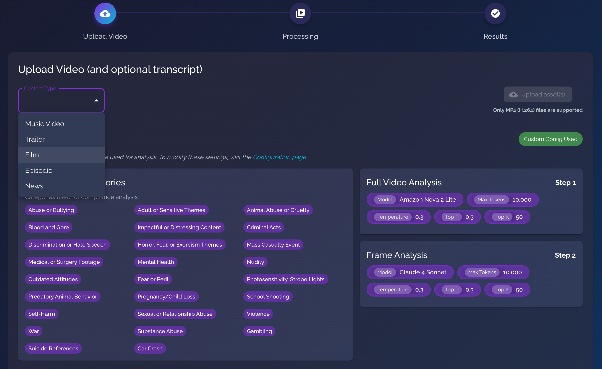
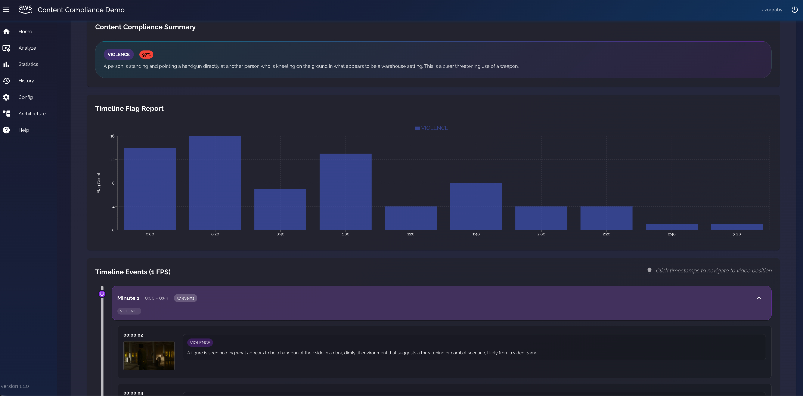
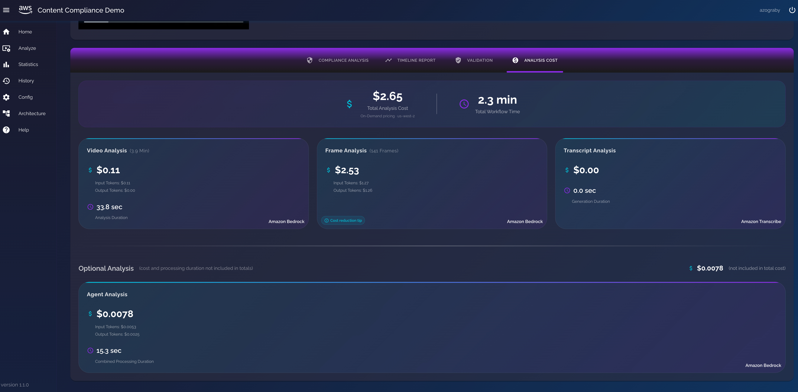
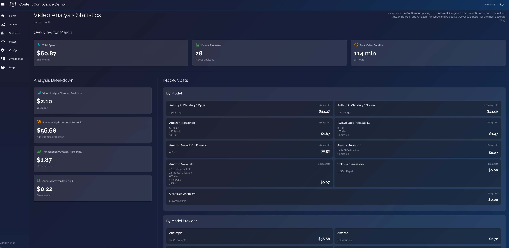
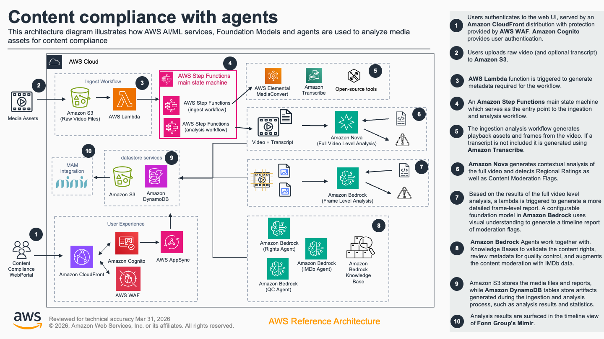

# Guidance for Automated Content Compliance with AI-powered Video Analysis and Agents

Automate content compliance with AI-powered video analysis that transforms hours of manual review into minutes, helping broadcasters and streaming platforms deliver compliant media content faster and more cost-effectively. Leverage Amazon Bedrock to analyze content across multiple rating systems, while maintaining accuracy, and reducing cost.

## Table of Contents

1. [Overview](#overview)
    - [Architecture](#architecture)
    - [Cost](#cost)
2. [Prerequisites](#prerequisites)
3. [Deployment Steps](#deployment-steps)
4. [Deployment Validation](#deployment-validation)
5. [Running the Guidance](#running-the-guidance)
6. [Next Steps](#next-steps)
7. [Cleanup](#cleanup)
8. [FAQ, known issues, additional considerations, and limitations](#faq-known-issues-additional-considerations-and-limitations)
9. [Notices](#notices)
10. [Authors](#authors)

## Overview

#### Overview of Problem

- Reviewing video/image content for compliance issues is challenging and costly
- Media companies are struggling with exploding content volumes, strict compliance requirements, and rising operational costs
- Compliance review times are increasing due to complex, multi-regional requirements
- Human review is error-prone and exhausting

#### Overview of Solution

- Automate the content moderation process with advanced video analysis using both video and image understanding models
- Ensure consistent reviews across your content library, reducing the number of false negatives
- Achieve a content rating, similar to popular media rating taxonomies
- Process long-form video of multi-hour long feature films
- Get detailed analysis results at the video, and frame-level including timestamp-level details of compliance flags
- Catches nuanced content elements that a human reviewer may miss, leaving compliance officers to focus on tasks that require human judgement

#### Why this Solution?

- Simply upload media to the system, and it automatically analyzes every frame against multiple rating systems and compliance standards
- Customize what flags you are looking for in the UI
- Choose your frame analysis rate in the UI (e.g. music videos, sports are dynamic and fast-changing, requiring a faster frame rate)
- Generate comprehensive compliance reports with frame-accurate timestamps
- Cost-optimization techniques such as perceptual hashing to reduce frame analysis cost of similar frames

#### Architecture

##### How it Works

1. **Configure** your analysis settings on the Config page. Choose which Bedrock models to use for video and frame analysis, adjust inference parameters (temperature, topP, maxTokens), set the pHash threshold for frame deduplication, and select house rating categories. These settings are used by the rest of the solution.
  

2. **Upload** an MP4 video on the Analyze page and select a content type (Film, Episodic, Trailer, Music Video, News). The content type determines the default frames-per-second rate used for frame extraction, as configured on the Config page.


3. An S3 upload event triggers an **AWS Step Functions workflow** that orchestrates the full pipeline:
   - **MediaConvert** generates HLS playback assets and thumbnail frames.
   - **Amazon Transcribe** generates a transcript (or you can provide one).
   - The video is split into segments and each segment is analyzed by a Bedrock model against your configured compliance categories.
   - **Frame-level analysis** runs concurrently using a Distributed Map, with pHash-based deduplication to skip similar frames.
   - **Bedrock Agents** run optional validations: rights clearance, QC language checks, and IMDb cross-referencing.
   - A **general and detailed compliance report** is generated.

4. **View results** on the Analysis Results page with video playback, segment-level findings, frame annotations, transcript, agent reports, and cost breakdown.  
  
  
  

All processing happens in the background. You can navigate away and find completed results in the History page.




##### Architecture Diagram


#### Pages

| Page | Description |
|---|---|
| **Analyze** | Upload MP4 videos and kick off the compliance workflow. Select content type and monitor upload progress. |
| **Analysis Results** | View compliance reports, video playback with HLS, frame-level findings, transcript, agent results, and analysis cost. |
| **History** | Browse all previously analyzed videos and their results. |
| **Config** | Configure which Bedrock models to use for video and frame analysis, adjust inference parameters (temperature, topP, maxTokens), set the pHash threshold for frame deduplication, and manage house rating categories. |
| **Statistics** | View cost and usage statistics across all your analyses for the current month. |
| **Architecture** | Overview of the AWS services and architecture powering the solution. |
| **Help** | FAQ, tips, troubleshooting, and known limitations. |


### Cost

This section is for a high-level cost estimate. Think of a likely straightforward scenario with reasonable assumptions based on the problem the Guidance is trying to solve. Provide an in-depth cost breakdown table in this section below ( you should use AWS Pricing Calculator to generate cost breakdown ).

Start this section with the following boilerplate text:

_You are responsible for the cost of the AWS services used while running this Guidance. As of <month> <year>, the cost for running this Guidance with the default settings in the <Default AWS Region (Most likely will be US East (N. Virginia)) > is approximately $<n.nn> per month for processing ( <nnnnn> records )._

Replace this amount with the approximate cost for running your Guidance in the default Region. This estimate should be per month and for processing/serving resonable number of requests/entities.

Suggest you keep this boilerplate text:
_We recommend creating a [Budget](https://docs.aws.amazon.com/cost-management/latest/userguide/budgets-managing-costs.html) through [AWS Cost Explorer](https://aws.amazon.com/aws-cost-management/aws-cost-explorer/) to help manage costs. Prices are subject to change. For full details, refer to the pricing webpage for each AWS service used in this Guidance._

### Sample Cost Table

**Note : Once you have created a sample cost table using AWS Pricing Calculator, copy the cost breakdown to below table and upload a PDF of the cost estimation on BuilderSpace. Do not add the link to the pricing calculator in the ReadMe.**

The following table provides a sample cost breakdown for deploying this Guidance with the default parameters in the US East (N. Virginia) Region for one month.

| AWS service  | Dimensions | Cost [USD] |
| ----------- | ------------ | ------------ |
| Amazon API Gateway | 1,000,000 REST API calls per month  | $ 3.50month |
| Amazon Cognito | 1,000 active users per month without advanced security feature | $ 0.00 |

## Prerequisites

### Operating System

- Local development/deployment has been tested on Mac and Windows
- For AWS environments, you may use Amazon Linux 2023

### Local Development

- **Node.js (v18.17+) and npm** — required for the frontend, CDK synthesis, and cross-platform Python Lambda bundling (uses `fs.cpSync`)
- **Python 3 and pip3** — required for installing Lambda function dependencies during deployment
- **AWS CLI** — configured with credentials (`aws configure`)
- **AWS Amplify CLI** — (`npm install -g @aws-amplify/backend-cli`)
- **AWS CDK CLI (v2)** — (`npm install -g aws-cdk`)

### Third-party tools

*Fonn Group's Mimir is optional in the architecture.*


### AWS account requirements

- **Amazon Bedrock foundation models** — ensure models selected are accessible
- **AWS CDK Bootstrap** — CDK must be bootstrapped once in each operating region if it doesn't already exist. Run `cdk bootstrap aws://<account-id>/<region>`, substituting the values. For detailed explanation, see [AWS CDK bootstrapping guide](https://docs.aws.amazon.com/cdk/v2/guide/bootstrapping.html)

### Service limits

- **Amazon Bedrock Model Throughput** — raise model limits depending on your current quotas, especially for long-form content
- **SSM Parameter Store High Throughput** — must be enabled to avoid `ThrottlingException` errors for long-form content. Run the following if applicable:
  ```bash
  aws ssm update-service-setting \
    --setting-id /ssm/parameter-store/high-throughput-enabled \
    --setting-value true
  ```

### Supported Regions

The solution has been tested with the **us-west-2** region extensively


## Deployment Steps

#### 1. Clone and install dependencies

```bash
git clone https://github.com/aws-solutions-library-samples/guidance-for-automated-content-compliance-with-ai-powered-video-analysis-and-agents-on-aws.git
cd guidance-for-automated-content-compliance-with-ai-powered-video-analysis-and-agents-on-aws
npm install
```

#### 2. Set your environment branch

Create or update `.env.local` at the project root:

```
AWS_BRANCH=<your-unique-name>
```

This value namespaces your SSM parameters and resources so multiple developers can deploy to the same account without conflicts.

#### 3. Configure Mimir secrets

The deployment requires Mimir SSM parameters to exist, even if you don't use Mimir. Run the setup script once per AWS account before the first deploy:

```bash
./scripts/setup-mimir.sh
```

It prompts for two values (either can be skipped by pressing Enter):

- **Custom Action Key** — the `x-api-key` value Mimir sends to your `/mimir-action` endpoint. The script creates a shared API Gateway key and stores its ID in SSM for CDK to import. Requires redeploy if you need to update it later.
- **API Token** — the bearer token used when pushing compliance data back to the Mimir API. Read at runtime; takes effect immediately.

All Mimir parameters are stored under `/shared/` in SSM, so they're shared across all branches in the account.

#### 4. Customize the rating system (recommended)

The default analysis prompt uses generic made-up rating categories that don't exist. For better accuracy, replace them with a well-known industry rating system and define what each level means. See [Customizing the Rating System](#customizing-the-rating-system) for details and examples.

#### 5. Deploy the backend (cloud sandbox via Amplify)

```bash
npm run sandbox
```

This uses `ampx sandbox` to deploy all backend resources into your AWS account. The first deploy takes several minutes.

OR, to stream Lambda logs in real time (optional):

```bash
npm run sandbox-logs
```

#### 6. Run the frontend locally

```bash
npm run dev
```

Open [http://localhost:3000](http://localhost:3000) in your browser. Sign up for an account through the Cognito-hosted auth flow.


## Deployment Validation

<Provide steps to validate a successful deployment, such as terminal output, verifying that the resource is created, status of the CloudFormation template, etc.>


**Examples:**

* Open CloudFormation console and verify the status of the template with the name starting with xxxxxx.
* If deployment is successful, you should see an active database instance with the name starting with <xxxxx> in        the RDS console.
*  Run the following CLI command to validate the deployment: ```aws cloudformation describe xxxxxxxxxxxxx```


## Running the Guidance

<Provide instructions to run the Guidance with the sample data or input provided, and interpret the output received.> 

This section should include:

* Guidance inputs
* Commands to run
* Expected output (provide screenshot if possible)
* Output description

## Next Steps 

#### Video Segmentation

Videos are split into fixed-length segments (default: 15 minutes) before analysis. Each segment is independently analyzed by the configured Bedrock model alongside its own transcript. The segment duration is configurable via `CHUNK_LENGTH` in `amplify/python-functions/createChunks/index.py` before deployment.

The current fixed-duration approach is intended for prototyping. For production use with long-form content, consider segmenting at scene, shot, or chapter level for more meaningful analysis boundaries.

#### Customizing the Rating System

The default analysis prompt uses generic rating categories ("Adult 18+", "Teen 13+", "Child 7+", "All Ages") that don't correspond to any real-world rating system. For more accurate and consistent results, replace these with well-known industry rating guidelines and provide explicit definitions for each level.

The rating prompt is defined in `amplify/python-functions/analyseChunks/index.py` under the `##JSON_GUIDELINES##` section. The relevant lines are:

```
- ##Suggested Rating##: "Adult 18+", "Teen 13+", "Child 7+", or "All Ages"
```

Replace these with a recognized system and add descriptions so the model understands what each level means.

The more specific your rating definitions are, the more consistently the model will classify content. This is especially important for borderline content where the distinction between adjacent ratings matters.

#### OPTIONAL: Configure CI/CD

For CI/CD deployment via AWS Amplify Hosting, connect your repository in the [Amplify console](https://console.aws.amazon.com/amplify/). The included `amplify.yml` handles the build pipeline. See the [Amplify deployment docs](https://docs.amplify.aws/nextjs/start/quickstart/nextjs-app-router-client-components/#deploy-a-fullstack-app-to-aws) for details.

#### OPTIONAL: Media Asset Management Integration

MIMIR is a MAM (Media Asset Management) system that supports "custom actions" — configurable menu items that appear on assets in the MIMIR UI. When a user right-clicks an asset and selects a custom action, MIMIR invokes an API endpoint in your AWS account with details about the selected asset(s) to run the compliance workflow and report results back into the MAM.


> **Note:** The current Mimir integration is a proof of concept developed with very restricted access to the Mimir tool. The code can be optimized further if you have full control over Mimir environment and permissions.

This solution includes two MIMIR integration points:

- **Inbound** (`/mimir-action`): MIMIR triggers the compliance workflow by downloading a video asset via the Mimir API and uploading it to the app's S3 bucket. Requests are validated using an API Gateway API key passed via the x-api-key header.
- **Outbound** (Push to Mimir): After analysis, compliance timeline data can be pushed back to MIMIR as timed metadata from the Timeline Report tab.

##### MIMIR Custom Action Setup

The Mimir custom action endpoint is at `{api-endpoint}/mimir-action`. After deploying, find the API endpoint in `amplify_outputs.json` under `custom.API`.

In the Mimir admin console, configure the custom action with:

| Field | Value |
|---|---|
| Custom Action URL | `{api-endpoint}/mimir-action?compliance-user-id={your-cognito-identity-id}` |
| Custom Header Field | `x-api-key` |
| Custom Header Value | The same key value you set in `./scripts/setup-mimir.sh` |

The `compliance-user-id` query parameter is the Cognito Identity ID of the app user whose history should show the analysis results. Videos are scoped per user in the UI, so this ensures Mimir-triggered analyses appear in the correct user's history.

Before deploying, run the setup script once per AWS account to configure both Mimir secrets:

```bash
./scripts/setup-mimir.sh
```

See the [MIMIR Action Handler README](amplify/python-functions/mimirActionHandler/README.md) for API details, request/response formats, and setup instructions.

## Cleanup

- Tear down the cloud sandbox with Amplify. See this [reference](https://docs.amplify.aws/react/deploy-and-host/sandbox-environments/features/#delete-a-sandbox) for delete options.
- Verify that any uploaded content has been deleted from the S3 bucket


## FAQ, known issues, additional considerations, and limitations 

**FAQ**

Refer to the list of FAQs in the "Help" section of the application.

**Known issues**

As models become deprecated, they may fail to be used in the app. Replace with newer versions to process media.

**Additional considerations**

*This solution is an accelerator / quick start.*

It is designed to help you quickly upload your videos and see compliance analysis results. There are many nuances and edge cases in content compliance that can be improved upon for production use. For example: segmentation at scene or shot level instead of fixed duration, better merging of segment-level results, and more robust error handling. Use this as a starting point and adapt it to your specific requirements.

Suggestions: 
- For more accurate suggested ratings (e.g. "Teen 13+"), define examples of what each rating level means in the analysis prompt. The default rating system uses generic categories — consider replacing them with well-known industry guidelines for better results.
- Configure analysis models and parameters in the Config page. 
- Select house rating categories to be used for content analysis. You can add custom categories beyond the default ones provided.
- Experiment with the inference parameters on the Config page.
- The Phash Threshold controls sensitivity for detecting duplicate or similar frames. This helps reduce analysis cost and time by avoiding analysis of frames that are too similar.


## Notices

*Customers are responsible for making their own independent assessment of the information in this Guidance. This Guidance: (a) is for informational purposes only, (b) represents AWS current product offerings and practices, which are subject to change without notice, and (c) does not create any commitments or assurances from AWS and its affiliates, suppliers or licensors. AWS products or services are provided “as is” without warranties, representations, or conditions of any kind, whether express or implied. AWS responsibilities and liabilities to its customers are controlled by AWS agreements, and this Guidance is not part of, nor does it modify, any agreement between AWS and its customers.*

> ⚠️ **Disclaimer:** This is an accelerator intended for experimentation and to demonstrate the art of the possible. Use it as a starting point and adapt it to your requirements. Please conduct thorough due diligence, security reviews, and testing before deploying in production environments.


## Authors

Alen Zograbyan  
Vince Palazzo  
Chris Gillespie  